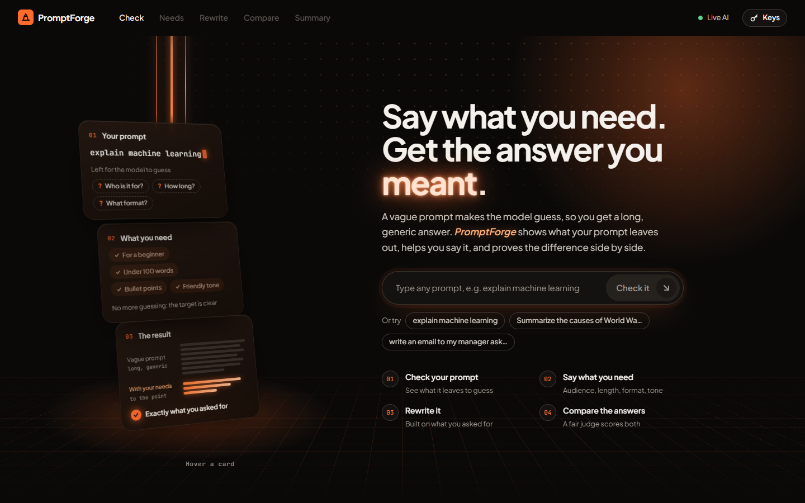
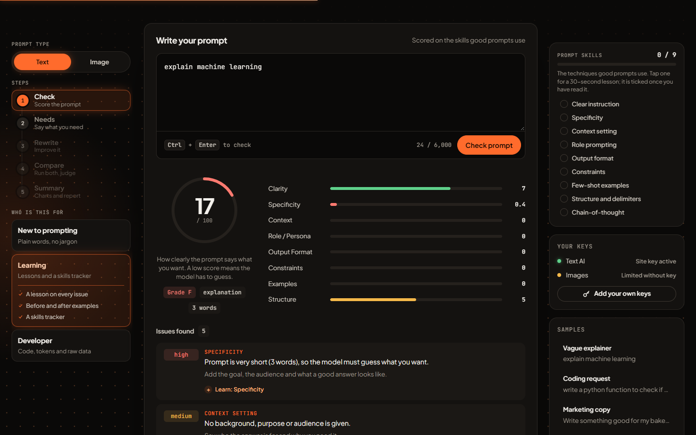
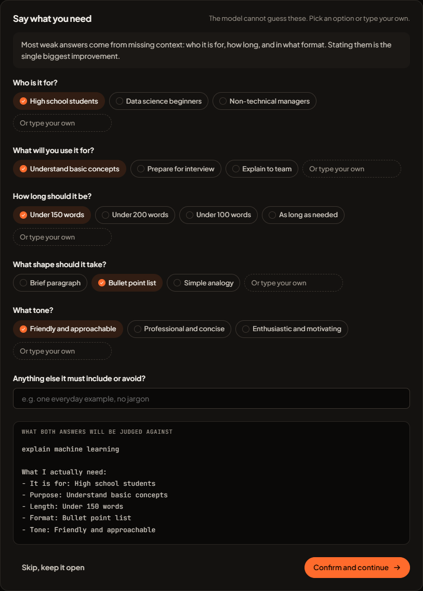
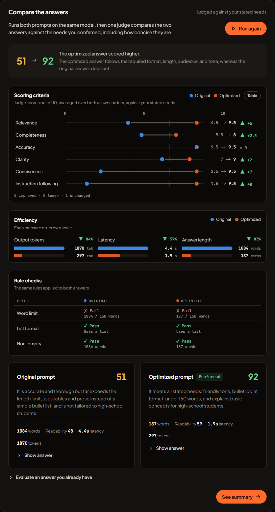
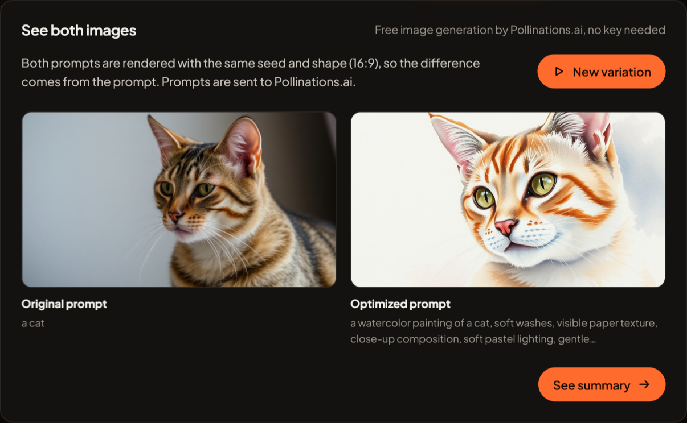
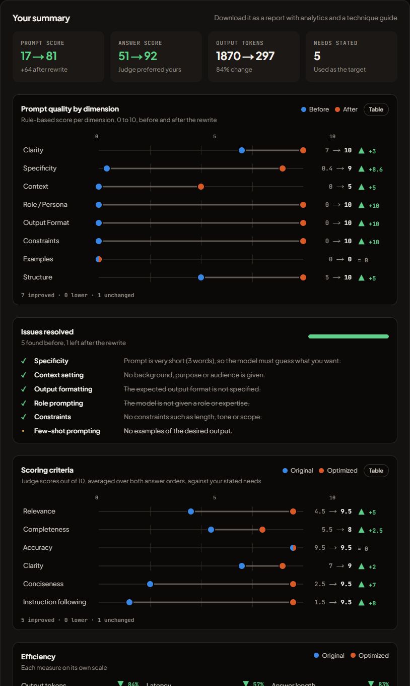
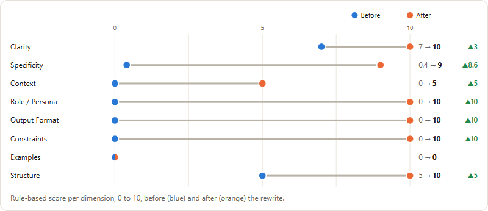

# PromptForge AI

An intelligent Generative AI platform that helps users **create, optimize and evaluate prompts** for Large Language Models (LLMs).

A vague prompt makes the model guess. PromptForge shows what your prompt leaves out, asks what you actually need (audience, purpose, length, format, tone), rewrites the prompt with proven techniques around those needs, then runs both versions and has a bias-corrected judge compare the answers against your stated needs.

**Live demo:** https://promptforge-ai-bay.vercel.app









## Features

The workspace has three columns. The left one stays pinned and always shows the prompt type, the five steps (current one highlighted) and your mode. The middle is a deck of five cards: each finished step flips to the next, and you can flip back at any time. Samples, history and keys are on the right.

| Card | What happens |
|------|--------------|
| 1. Check | Score any prompt 0–100 (8 dimensions for text, 8 visual elements for images) with a ranked list of what is missing. |
| 2. Needs | Confirm who it is for, the purpose, length, format and tone (for images: use, style, shape, framing, mood, what to avoid), from suggested options or your own words. |
| 3. Rewrite | The prompt is rewritten around your needs with proven techniques, with a before/after score and every change explained. |
| 4. Compare | Text: both prompts run on the same model and a bias-corrected judge compares the answers against your needs. Shown as charts: a before/after dumbbell for the six scoring criteria, paired bars for tokens, latency and length, and the rule checks side by side. Images: both prompts are rendered with the same seed, with an element chart and render times. |
| 5. Summary | Prompt dimensions before/after, issues resolved, criteria and efficiency charts, downloadable as a designed HTML report with the same charts (save as PDF) or JSON. |

**Three modes**

- **New to prompting:** a one-line verdict in plain words, the top issues only, one "Improve my prompt" button.
- **Learning:** a short lesson (what, why, before/after) for every issue and change, and a skills tracker; tap a technique to read its lesson and tick it off.
- **Developer:** "Use this prompt in your own app" code panel (Node.js, Python, cURL with setup steps), token estimates, raw analysis JSON and JSON export.

**Image prompts** are rendered by [Pollinations.ai](https://pollinations.ai). Without a key only a couple of images work. For regular use, create a **Personal Secret Key (`sk_…`)** at [enter.pollinations.ai](https://enter.pollinations.ai/keys), give it a small Pollen budget (free Pollen comes from Quests, no card needed), and set it as `POLLINATIONS_API_KEY` on the server.







## Tech stack

- **Next.js 15 (App Router) + React 19 + TypeScript**: UI and serverless API routes in one project, deploys to Vercel with zero config.
- **Pollinations.ai**: free image generation for image prompts (free key for regular use), called through a server route so the key stays private.
- **Groq API (`openai/gpt-oss-120b`)**: free tier and very fast responses. Any OpenAI-compatible API works by changing `LLM_BASE_URL` and `LLM_MODEL`.
- **Rule-based analyzer (TypeScript)**: deterministic, instant, works offline, and makes results reproducible for benchmarking.
- **Node.js test runner**: unit tests with no extra dependencies.

## Run locally

Requires Node.js 22 or newer.

```bash
npm install
cp .env.example .env.local   # then paste your Groq key into LLM_API_KEY (optional)
npm run dev                  # http://localhost:3000
```

Get a free Groq key at https://console.groq.com/keys. Without a key, the app runs in offline mode. Users can also paste their own key in **Settings**; it is stored only in their browser.

## Tests and benchmark

```bash
npm test            # 22 unit tests
npm run benchmark   # scores 20 labelled prompts + 5 injection attempts
```

With `LLM_API_KEY` set, the benchmark also optimizes the 10 weak prompts with their real needs, runs both versions, and compares the answers head to head in both orders, against the real need and against the bare request. Results are written to `benchmark-results.json`.

## Architecture


## Results

Live run on Groq `openai/gpt-oss-120b`, 9 weak prompts, each with a hand-written real need (`npm run benchmark`):

| | Vague prompt | PromptForge prompt |
|---|---|---|
| Judge score against the real need | 51.2 | **92.7** (9 of 9 wins) |
| Judge score against the vague request | 85.1 | 80.1 |
| Met the requested word limit | 2 of 9 | 7 of 9 |
| Average answer length | 487 words | 112 words (−77%) |
| Output tokens / latency | 778 / 3.7 s | 197 / 2.0 s |

Judged against a vague request, a long generic answer looks fine. Judged against what the person actually needed, it loses every time. That is why PromptForge asks what you need before it rewrites anything.

Analyzer: 95% weak vs strong classification on 20 labelled prompts, 5/5 prompt injections detected with 0 false positives, about 1 ms per analysis.

### How answers are compared

Both answers go to one judge call and are scored against the **same target**: your original request plus the needs you confirmed, on relevance, completeness, accuracy, clarity, conciseness and instruction following. Each pair is judged twice with the order swapped, because LLM judges favour whichever answer they read first. The winner is decided from the averaged criterion scores, not the judge's free-choice pick (which leans towards longer answers), and only when both orders agree.

## Project structure

```
app/
  page.tsx               UI: check → needs → rewrite → compare workflow
  api/analyze/route.ts   rule-based analysis + optional AI critique
  api/optimize/route.ts  LLM rewrite, falls back to templates
  api/generate/route.ts  runs a prompt on the LLM
  api/intent/route.ts    suggests likely needs for a prompt (text or image)
  api/image/route.ts     renders an image prompt with Pollinations.ai
  api/evaluate/route.ts  LLM judge + rule checks for a single answer
  api/compare/route.ts   head-to-head judge of two answers (one order per call)
  api/status/route.ts    reports whether a server key is configured
lib/
  analyzer.ts            8-dimension scoring, issues, task type, injection detection
  optimizer.ts           offline template optimizer and technique list
  metrics.ts             response checks (word limit, JSON, table, readability…)
  judge.ts               pairwise judge, both-order combining, bias handling
  intent.ts              needs model, presets, the judging yardstick
  image.ts               image prompt analyzer, needs, offline rewrite, sizes
  lessons.ts             technique lessons for Learning mode and the report
  report.ts              downloadable HTML/JSON session report
  snippets.ts            code snippets for Developer mode
  llm.ts                 OpenAI-compatible client + tolerant JSON parser
  prompts.ts             system prompts for critic, optimizer and judge
tests/                   unit tests
scripts/benchmark.ts     evaluation script
```

## Deploy to Vercel

1. Push this repository to GitHub.
2. On https://vercel.com/new, import the repository (framework is detected automatically).
3. Add the environment variable `LLM_API_KEY` with your Groq key, and optionally `POLLINATIONS_API_KEY` for images.
4. Deploy.

## Security

No API keys are stored in this repository. `.env.local` is git-ignored.

---

Made with care by **Nayani Paul** · [Portfolio](https://nayani-paul-portfolio.vercel.app)
