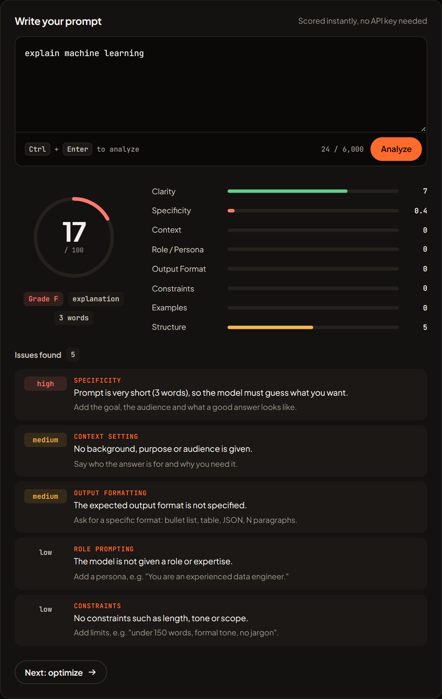
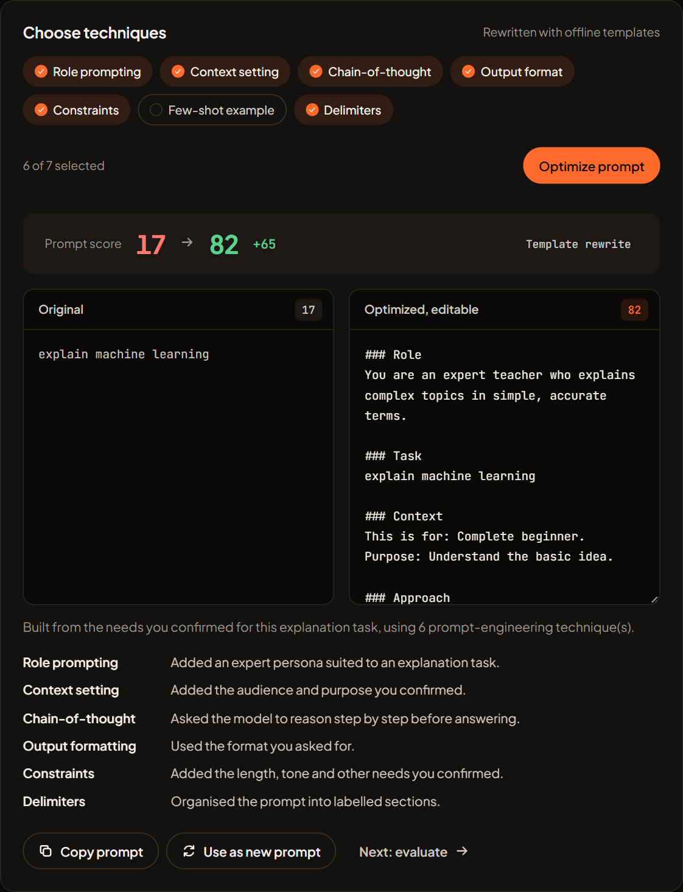
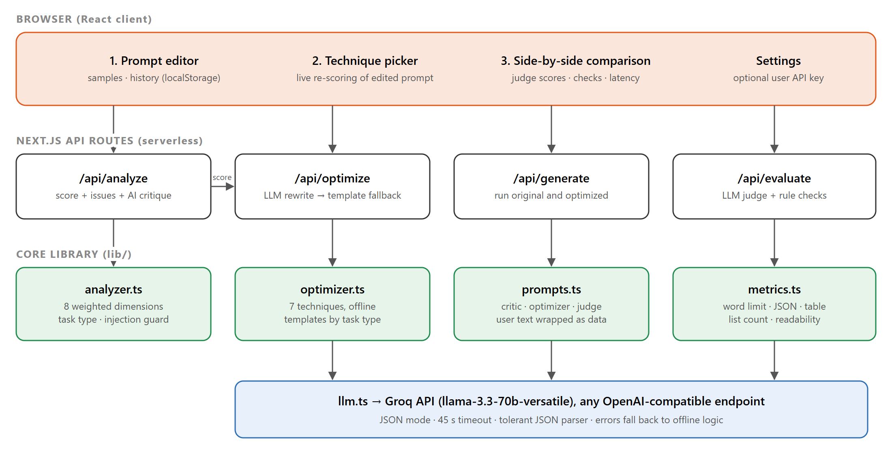

# PromptForge AI

An intelligent Generative AI platform that helps users **create, optimize and evaluate prompts** for Large Language Models (LLMs).

PromptForge analyzes a prompt, finds its weaknesses, rewrites it with proven prompt-engineering techniques, then runs the original and optimized prompts side by side and scores both responses with an LLM judge.

**Live demo:** _add your Vercel link here_





## Features

| Step | What the user can do |
|------|----------------------|
| 1. Analyze | Score any prompt 0–100 on 8 weighted dimensions (clarity, specificity, context, role, output format, constraints, examples, structure), see a grade, the detected task type and a ranked list of issues with fixes. Optional AI critique from the LLM. |
| 2. Optimize | Pick techniques (role prompting, context, chain-of-thought, output format, constraints, few-shot, delimiters) and get a rewritten prompt with a before/after score and a list of every change. The result is editable and re-scored live. |
| 3. Evaluate | Run both prompts on the same model. Each response is scored by an LLM judge on relevance, completeness, accuracy, clarity and instruction-following, plus rule-based checks (word limits, JSON validity, tables, code blocks, list counts, readability). |
| Iterate | Use the optimized prompt as the new starting point and repeat. |
| History | The last 20 optimizations are kept in the browser with their scores. |
| Guardrails | Prompt-injection patterns are detected, capped at a score of 20 and never optimized or executed. User text is always passed to the LLM as tagged data. |

PromptForge works in two modes:

- **Live AI**: with an API key, the LLM does the critique, rewrite, generation and judging.
- **Offline**: without a key, the rule-based analyzer and template optimizer still work, so the app is always usable.

## Tech stack

- **Next.js 15 (App Router) + React 19 + TypeScript**: UI and serverless API routes in one project, deploys to Vercel with zero config.
- **Groq API (`openai/gpt-oss-120b`)**: free tier and very fast responses. Any OpenAI-compatible API works by changing `LLM_BASE_URL` and `LLM_MODEL`.
- **Rule-based analyzer (TypeScript)**: deterministic, instant, works offline, and makes results reproducible for benchmarking.
- **Node.js test runner**: unit tests with no extra dependencies.

## Run locally

Requires Node.js 22 or newer.

```bash
npm install
cp .env.example .env.local   # then paste your Groq key into LLM_API_KEY (optional)
npm run dev                  # http://localhost:3000
```

Get a free Groq key at https://console.groq.com/keys. Without a key, the app runs in offline mode. Users can also paste their own key in **Settings**; it is stored only in their browser.

## Tests and benchmark

```bash
npm test            # 14 unit tests
npm run benchmark   # scores 20 labelled prompts + 5 injection attempts
```

With `LLM_API_KEY` set, the benchmark also optimizes the 10 weak prompts with the LLM, generates answers for the original and optimized versions, and compares them head to head in both orders. Results are written to `benchmark-results.json`.

## Architecture



## Results

From `npm run benchmark` (20 hand-labelled prompts, 5 injection attempts; live runs on Groq `openai/gpt-oss-120b`):

| Metric | Result |
|---|---|
| Weak vs strong prompt classification | 95% (19/20) |
| Prompt-injection detection | 5/5, 0 false positives |
| Prompt score of weak prompts after LLM optimization | 21.8 → 71–81 |
| Answer quality, original vs optimized (head-to-head judge, both orders) | 88.8 vs 89.4, within judging noise |
| Output tokens per answer, original → optimized | 993 → 529 (−47%) |
| Latency per answer, original → optimized | 2.5 s → 1.5 s (−39%) |

On a strong model, optimized prompts give answers of the same quality that are shorter, faster and more structured.

### How answers are compared

Both answers go to one judge call and are scored against the **original** request on relevance, completeness, accuracy, clarity, conciseness and instruction following. Each pair is judged twice with the order swapped, because LLM judges favour whichever answer they read first. The winner is decided from the averaged criterion scores, not the judge's free-choice pick (which leans towards longer answers), and only when both orders agree. Otherwise the result is reported as too close to call.

## Architecture


## Results

From `npm run benchmark` (20 hand-labelled prompts, 5 injection attempts, Groq `openai/gpt-oss-120b`):

| Metric | Result |
|---|---|
| Weak vs strong prompt classification | 95% (19/20) |
| Prompt-injection detection | 5/5, 0 false positives |
| Prompt score of weak prompts after LLM optimization | 21.8 → 80.6 |
| LLM-judge score of answers, original vs optimized | 91.6 vs 90.2 (no measurable gain) |
| Mean generation latency | 2.1 s |

On a strong model, optimized prompts made answers more structured but did not raise judged quality for simple requests. An earlier optimizer version that added unrequested limits made answers worse (92.2 vs 87.2), and was fixed.

## Project structure

```
app/
  page.tsx               UI: analyze → optimize → evaluate workflow
  api/analyze/route.ts   rule-based analysis + optional AI critique
  api/optimize/route.ts  LLM rewrite, falls back to templates
  api/generate/route.ts  runs a prompt on the LLM
  api/evaluate/route.ts  LLM judge + rule checks for a single answer
  api/compare/route.ts   head-to-head judge of two answers (one order per call)
  api/status/route.ts    reports whether a server key is configured
lib/
  analyzer.ts            8-dimension scoring, issues, task type, injection detection
  optimizer.ts           offline template optimizer and technique list
  metrics.ts             response checks (word limit, JSON, table, readability…)
  judge.ts               pairwise judge, both-order combining, bias handling
  llm.ts                 OpenAI-compatible client + tolerant JSON parser
  prompts.ts             system prompts for critic, optimizer and judge
tests/                   unit tests
scripts/benchmark.ts     evaluation script
```

## Deploy to Vercel

1. Push this repository to GitHub.
2. On https://vercel.com/new, import the repository (framework is detected automatically).
3. Add the environment variable `LLM_API_KEY` with your Groq key.
4. Deploy.

## Security

No API keys are stored in this repository. `.env.local` is git-ignored.
